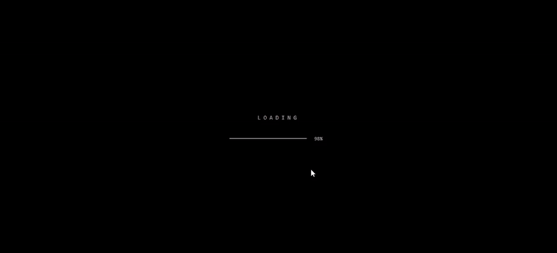

# Glitch



***[Click here for Live Demo](https://iamovi.github.io/glitch)***

## A Portfolio Template

A high-performance, creative portfolio template built with React, Vite, and GSAP. Designed for developers and creatives who want a bold, immersive digital presence.

## Tech Stack

- React 18
- Vite
- TypeScript
- GSAP (GreenSock Animation Platform)
- Tailwind CSS
- shadcn/ui
- Framer Motion

## Features

- Glitch text effects
- Magnetic button interactions
- Smooth scroll animations
- Responsive navigation
- Modern, minimalist design system
- Optimized performance with GSAP context

## Getting Started

### Prerequisites

- Node.js (v18 or higher)
- npm or bun

### Installation

1. Clone the repository:
   ```bash
   git clone <this-repo-url>
   ```

2. Install dependencies:
   ```bash
   npm install
   ```
   or
   ```bash
   bun install
   ```

3. Start the development server:
   ```bash
   npm run dev
   ```

## Customization

### Personal Information

Modify the content in `src/components/sections/` to update your details:
- `Hero.tsx`: Update your name and headline.
- `About.tsx`: Edit your bio and expertise list.
- `Work.tsx`: Add your projects to the `projects` array.
- `Contact.tsx`: Update your email and social media links.

### Styling

- `tailwind.config.ts`: Customize the color palette and theme.
- `src/index.css`: Edit global styles and custom animations.

## Production Build

To create a production-ready bundle:

```bash
npm run build
```

The output will be in the `dist/` directory.

## License

[MIT](LICENSE)

**Crearted by [Ovi ren](https://iamovi.github.io)**
